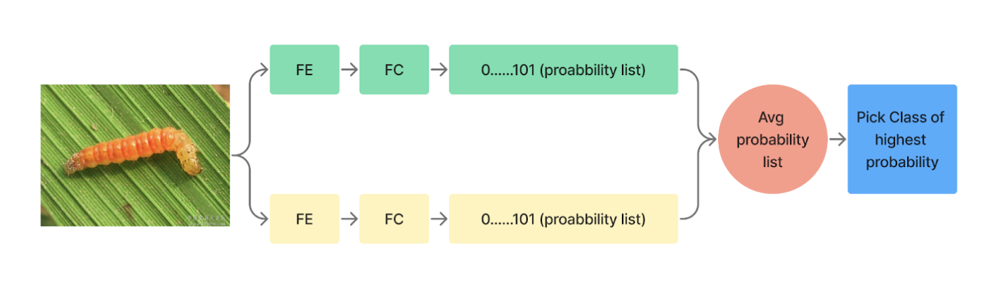

::: titlepage
::: center
{width="5cm"}\
**[Islamic University of Technology]{.smallcaps}**\
[Department of Computer Science and Engineering]{.smallcaps}\
**[An Efficient Deep Learning-based approach for Recognizing
Agricultural Pests in the Wild]{.smallcaps}**\
:::

::: center
*Authors:*\
Mohammad Ratul Mahjabin, 180042123\
Md Sabbir Rahman, 180042142\
Mohtasim Hadi Rafi, 180042145\

*Supervisor:*\
Dr. Md. Hasanul Kabir\
*Professor, Department of Computer Science & Engineering,\
Islamic University of Technology\
* *Co-Supervisor:*\
Sabbir Ahmed\
*Assistant Professor, Department of Computer Science & Engineering,\
Islamic University of Technology\
* May, 2023
:::
:::

::: titlepage
::: center
{width="5cm"}\
**[Islamic University of Technology]{.smallcaps}**\
[Department of Computer Science and Engineering]{.smallcaps}\
**[An Efficient Deep Learning-based approach for Recognizing
Agricultural Pests in the Wild]{.smallcaps}**\
:::

::: center
*Authors:*\
Mohammad Ratul Mahjabin, 180042123\
Md Sabbir Rahman, 180042142\
Mohtasim Hadi Rafi, 180042145\

*Supervisor:*\
Dr. Md. Hasanul Kabir\
*Professor, Department of Computer Science & Engineering,\
Islamic University of Technology\
* *Co-Supervisor:*\
Sabbir Ahmed\
*Assistant Professor, Department of Computer Science & Engineering,\
Islamic University of Technology\
* May, 2023
:::
:::

::: center
**Certificate of Approval**
:::

The thesis titled, **\"An Efficient Deep Learning-based approach for
Recognizing Agricultural Pests in the Wild\"** submitted by Mohammad
Ratul Mahjabin, St No. 180042123, MD. Sabbir Rahman, St. No. 180042142,
Mohtasim Hadi Rafi, St. No. 180042145 of Academic Year 2021-2022 has
been found as satisfactory and accepted as partial fulfillment of the
requirement for the degree Bachelor of Science in Software Engineering
on April 20, 2023.\
**Board of Examiners:**\
Dr. Md. Hasanul Kabir\
Professor\
Department of Computer Science and Engineering\
Islamic University of Technology (IUT), Gazipur\
Sabbir Ahmed\
Assistant Professor\
Department of Computer Science and Engineering\
Islamic University of Technology (IUT), Gazipur\

::: center
**Declaration**
:::

It is hereby declared that-

-   The report that is submitted is our original work at the time of
    completing our BSc in Software Engineering at Islamic University of
    Technology.

-   The report does not include any already published or written by a
    third party content, unless it is properly cited in the references.

-   The content of the thesis has not been previously approved or
    submitted for consideration for any other degree or certificate as
    our knowledge

-   All significant sources of assistance have been acknowledged.

**Student's Full Name & Signature:**

::: center
  ----------------------------- ---------------------- ------------------------
  **Mohammad Ratul Mahjabin**   **Md Sabbir Rahman**   **Mohtasim Hadi Rafi**
  180042123                     180042142              180042145
  ----------------------------- ---------------------- ------------------------
:::

Date: 20 May, 2023

::: center
**Dedication**\

::: center
To the people who are working tirelessly to remove hunger from the
world,\
who strive to provide sustenance to those in need,\
who believe that no one should go to bed hungry,\
this thesis is dedicated to you.\
Your unwavering dedication to ending world hunger inspires us to do our
part in creating a better future for all.\
Thank you for your tireless efforts and commitment to this vital cause.\
:::
:::

::: center
**Acknowledgement**
:::

First of all, all praise to Allah swt for whom our thesis report have
been completed without any major interruption. Second, we would like to
thank our supervisor, Dr. Md. Hasanul Kabir sir and co supervisor Sabbir
Ahmed sir for their kind assistance and suggestions. They came to our
aid anytime we needed it.\
We also like to thank the staff, instructors, and students of Islamic
University and Computer Vision Lab in the Department of Computer Science
and Engineering.\
It would not be able to carry out this work without the appropriate
assistance of all these people. And finally, thanks to our parents,
without whom we will not be able to be here.\
We are currently preparing to graduate thanks to their kind prayers and
support.

::: center
\
\[It is He\] who has made for you the earth as a bed \[spread out\] and
inserted therein for you roadways and sent down from the sky, rain and
produced thereby categories of various plants.\
:::

::: flushright
\- SURAH TA-HA AYAT 53 (20:53 QURAN)
:::

# Introduction

## Motivation

The escalating global population and the ever-increasing demand for food
have underscored the urgent need to enhance agricultural productivity
while effectively managing the impact of agricultural pests on crop
yields and quality. One significant factor that hampers agricultural
productivity is the damage caused by insect pests to crops worldwide
each year. Preventing such damages is crucial for commercial benefits,
improved agricultural efficiency, and avoiding significant harvest
losses. In addition to reducing the yield, crop pests can also inflict
damage on machinery, equipment, soil, and infrastructure
[@kandalkar2014classification]. Conventional methods employed to
identify and classify agricultural pests in the wild are often
characterized by time-consuming and expensive processes that heavily
rely on expert knowledge. As a result, there is a compelling necessity
for the development of an innovative and efficient approach to address
this challenge.

By mitigating these problems, agriculture can drive economic growth
while producing food with reduced resource consumption. Consequently,
the recognition and classification of pests assume paramount importance
in preventing crop damage. In recent years, there has been a notable
surge of interest in automatic pests' classification [@xia2018insect].
Studies have shown that early detection and treatment can minimize
damage to almost zero. However, this task is far from easy, as current
methods for identifying insect pests are inefficient and expensive,
relying heavily on the technical expertise of agricultural
professionals.

Deep learning technology has emerged as a powerful tool in various
fields, showcasing remarkable achievements, particularly in image-based
tasks. This technology offers a promising opportunity to create a highly
accurate and scalable solution for the recognition and classification of
agricultural pests in diverse environmental conditions. By leveraging
deep learning algorithms, it becomes possible to train models that can
effectively analyze and interpret complex visual data, enabling accurate
identification and classification of pests present in agricultural
settings.

Exploiting deep learning technology offers immense potential in
revolutionizing pest classification by providing efficient and
cost-effective solutions. By leveraging the power of deep learning
algorithms, researchers can develop robust models capable of accurately
identifying and classifying insect pests, even in large-scale
agricultural settings. The utilization of deep learning techniques can
enhance the speed, accuracy, and scalability of pest detection and
enable early intervention to minimize crop damage effectively.

Fortunately, advancements in deep learning techniques have paved the way
for their adaptation across various domains, yielding remarkable
results. Deep learning has achieved significant breakthroughs,
particularly in image-based computer vision tasks such as image
classification, segmentation, and detection
[@reyes2015fine; @he2016deep; @huang2017densely]. The field of
agriculture has also witnessed the successful application of deep
learning methods in diverse areas, including plant identification,
recognition, and classification
[@reyes2015fine; @dyrmann2016plant; @zhang2018deep; @ji20183d; @lin2019fourier],
fruit counting [@chen2017counting], and plant disease detection
[@mohanty2016using].

As the world grapples with the challenge of feeding an ever-growing
population, ensuring food safety becomes imperative. Addressing the
issue of insect pests, a major cause of crop damage, is crucial for
improving agricultural productivity. Deep learning technology, with its
significant achievements in image-based computer vision tasks, holds
tremendous promise in the field of agriculture. By harnessing deep
learning algorithms, researchers can enhance the recognition and
classification of pests, leading to more efficient and cost-effective
solutions for safeguarding global food production.

## Problem Statement

Our research endeavors encompassed a comprehensive array of experiments
conducted on the esteemed IP102 dataset [@wu2019ip102], which is widely
acknowledged in the field of agricultural pest recognition and
classification. This dataset posed multifaceted challenges that required
meticulous attention to detail in order to derive robust solutions.
Notably, these challenges included the presence of pests within
intricate backgrounds and foregrounds, the remarkable variability in
their size, shape, color, and texture, and the marked imbalance in
sample distribution among different pest species.

To surmount these hurdles and fortify the efficacy of our models, we
devised a series of astute strategies that leveraged cutting-edge
techniques. In particular, we delved into the realm of combined feature
extraction, deftly merging ConvNext, an acclaimed architecture, with the
innovative Vision Transformer (ViT) feature extractor. This synergistic
amalgamation enabled us to harness the distinctive strengths of both
architectures, culminating in an enhanced ability to capture a diverse
range of features that are crucial for discerning and distinguishing
between different pests with utmost precision.

Furthermore, we meticulously fine-tuned the linear dropout
hyperparameter, painstakingly seeking an optimal equilibrium that would
effectively mitigate the risks of overfitting while concurrently
amplifying the generalization prowess of our models. This nuanced
fine-tuning process imbued our models with a refined aptitude for
accommodating diverse and unseen data samples with remarkable finesse.

Addressing the challenges emanating from complex backgrounds and
foregrounds necessitated a meticulous exploration of transfer learning
and fine-tuning methodologies. By adroitly harnessing the immense
knowledge encapsulated within pre-trained models and adorning them with
specialized adaptations to suit the intricacies of agricultural pest
classification, we attained unprecedented strides in performance
optimization. Furthermore, we judiciously employed ingenious data
augmentation techniques such as Fmix and Cutmix to ingeniously alleviate
the prevailing data/class imbalance and to augment the richness and
diversity of our training samples. Additionally, we harnessed the
potential of a cropped dataset, expertly extracting the regions of
interest (ROI), and skillfully employing segmentation techniques to
meticulously isolate and focus on the pivotal pest-related regions
within the images.

The significance of attention-based methods was profoundly underscored
in our research endeavors. We fervently explored multiple CNN-based
models, adroitly integrating attention mechanisms into the core fabric
of our models. A quintessential embodiment of this was manifested
through the incorporation of the Convolution Block Attention Module
(CBAM), an avant-garde innovation that facilitated an adaptive
recalibration of feature maps, enabling our models to dynamically
emphasize and prioritize the salient regions relevant to the pests under
consideration. This judicious emphasis on pertinent information
translated into a remarkable enhancement in the accuracy and acuity of
our pest classification endeavors.

In our relentless quest for superior performance and minimized
generalization errors, we judiciously employed ensemble methods, an
ingenious approach that synergistically harnessed the collective wisdom
of multiple models. Through astute employment of soft voting and hard
voting mechanisms, we deftly amalgamated the predictions generated by
the diverse array of models at our disposal. This ensemble-based
confluence of perspectives endowed our models with heightened confidence
and decisiveness, thereby effectively curtailing the risks associated
with generalization errors and fostering superior classification
outcomes.

## Organization

Moreover, our research encompassed an incisive examination of the
challenges posed by intra-class dissimilarity and inter-class
similarity. By deftly stratifying pests based on their distinct life
stages, namely early and late stages, we embarked upon a revelatory
exploration of the metamorphic nature exhibited by most pests. This
compelling insight enabled us to not only discern the prominent
intra-class dissimilarities but also delineate the striking inter-class
similarities that surfaced when considering pests throughout their life
cycles. This meticulous classification based on pest stages served as a
powerful tool for enhancing classification accuracy and, simultaneously,
provided invaluable insights into the developmental. This insightful
classification based on pest stages served as a powerful tool for
enhancing classification accuracy and providing valuable insights into
the developmental aspects of pests [@ji20183d; @lin2019fourier].

We have divided the paper into five more sections. The second section
consists of literature review. We have read and reviewed other research
works done in recent years in this domain and tried to find out the
research problems. In the third section, namely methodology, we have
discussed about our experiments and proposed methods. The fourth section
consists of the results of our experiments and we tried comparing our
results with other literature to find out where we stand. Finally we
draw a conclusion to the paper and discussed what are the impacts of
this work.

# Literature review

Many researchers have used deep learning algorithms in agriculture in
recent years. GoogleNet, AlexNet, ResNet, and other deep convolutional
neural networks perform admirably well for image classification tasks.
The majority of the applications, however, are focused on weed
identification [@dyrmann2016plant] plant recognition
[@reyes2015fine; @zhang2018deep], fruit counting [@chen2017counting],
and crop type [@zhang2018deep] classification.

## Subdomains in agriculture

Research in agriculture is important because it helps to improve the
efficiency, productivity, and sustainability of agricultural practices.
By studying the best ways to grow crops, raise livestock and fisheries,
and manage pests and diseases, researchers can help to increase crop
yields, reduce the need for chemical inputs, and protect the
environment. The agriculture field is very vast there are a number of
domains to work on here. Kamilaris and Prenafeta-Boldu
[@14_kamilaris2018deep] and Saleem et al [@15_saleem2019plant] have
identified the subdomains of the agriculture domain as follows-

-   Plant leaf disease detection, segmentation and diagnosis

-   Plant disease detection and diagnosis

-   Crop pest detection

-   Crop analysis with aerial image

-   Crop weed detection

-   Crop yield (harvest) prediction

-   Crop classification

-   Crop growth monitoring

## Use of deep learning and it's influencing factors

Different machine learning techniques name as Regression, Clustering,
Bayessian Models, Instance Based Models, Decision Trees, SVM, KNN etc
are being used already in this domain [@16_liakos2018machine]. These
techniques had put some impact results in the research of agriculture
system automation but the real evolution came when deep learning
architecture took the place. Now networks can be more deeper and a lot
of resources can be used to feed the networks. That shows tremendous
advancement in the field of computer vision based agricultural research.
Researchers now using different deep learning networks like CNN,
GoogleNet, Resnet, VGG , Inception etc [@14_kamilaris2018deep]. As
agriculutre based sectors are based on mostly image and video clips.
Deep learning techniques has a large impact on this. After studying some
survey papers we narrowed down the field by selecting two sub sectors
which seemed to have more potential. The fields are plants' disease
detection, segmentation & diagnosis and crop pest classification. First
we conducted studies on plant disease detection. There are some factors
which influences highly for deep learning based plant disease
recognition[@17_barbedo2018factors]-

-   **Limited annoted dataset:** There are not enough qualityfull
    dataset in this agriculture field. Making a good dataset in this
    field not so easy. First of all, enough sample should be ensured to
    feed the deep learning networks. Secondly data annotation should be
    done carefully because it is very difficult for an ordinary person
    to identify different disease or crops of agriculture field.
    Moreover these disease or crops may be at the different growth stage
    of the life.

-   **System representation:** There are a lot of types and varieties
    are available in this field. There are different species and classes
    for a single plant. Moreover a same plant may look different based
    on different conditions and environments. Without this there may be
    a similar disease or pest which can affect multiple plant species.
    So a good representation of these info in the dataset is very
    important which is a rare case.

-   **Covariate shift:** At the time of training and evaluating a method
    on the same dataset, the model's performance is often overstated
    because it will fail when implemented to other datasets. As
    previously stated, datasets are not robust, and even the same plant
    can appear differently in different locations, so models frequently
    fail to perform well for images other than their own testing and
    training datasets.

-   **Image background:** Complex background is a big problem in this
    sector. For example a single disease may effect different plant but
    the color, size in the background can be different. Moreover there
    will be soil , grass, different plants hands etc present in the
    picture. Often the focused object like disease zone or pest can be
    differ in size. There are also huge possibility of color similarity
    between the focused objects and the background. The focused leaf or
    crop can be damged differently also for different which can cause
    change in the background.

-   **Image capture condition:** Images captured in most of the datasets
    differ from one to another depending on the condition of the day,
    light time, camera positioning, environment and so many. Due to the
    reason, region of interest looks different from one image to another
    in the same class or even same insect of the same dataset.

-   **Symptom segmentation:** The fact that it is not essential to
    precisely identify the indicators in the image is one of the key
    benefits of employing deep learning methods.The issue of symptom
    segmentation is not pertinent in this situation, despite the fact
    that it may be useful to isolate the area where the symptom is
    present because it often contains the majority of the crucial
    information. The results were not significantly changed by expanding
    the sample size or by limiting the study area to the site of the
    symptoms. Furthermore, by concentrating on specific nodules, it is
    feasible to integrate the predicted classes to develop a
    comprehensive diagnostic for the plant, which might lessen the
    impact of individual misclassifications.

-   **Symptom variations:** While the majority of diseases have
    recognizable visual symptoms, these symptoms frequently vary in
    appearance, especially in terms of color, shape, and size. Due to
    this unpredictability, it may be difficult to employ
    visible-spectrum-based image-based diagnostics to discriminate
    between healthy and unhealthy pixels. [@17_barbedo2018factors]. As
    symptoms can range from being extremely faint and barely perceptible
    in the early stages of infection to causing extensive tissue death
    in the most advanced stages, the stage of the disease (or the
    intensity of the symptoms) is probably the most significant source
    of heterogeneity. This means that differentiating various diseases
    may be simpler or more difficult depending on the stage of
    infection.

-   **Simultaneous disorders:** Images typically have an illness tagged
    next to them. However, it is typical for several illnesses or other
    types of issues, like nutrient deficits or pests, to exist
    concurrently. This is frequently true because weakened by one virus,
    a plant's immune system can make it more vulnerable to other
    diseases. Creating mixed classes with all conceivable combinations
    of disorders could be one solution to this problem. This strategy is
    not realistic, though, as there would be an excessive number of
    classifications, which would raise the possibility of
    misclassification. Additionally, the inter-variability would be too
    high because the percentage of symptoms linked to each disease can
    differ from one image to the next.

-   **Disorders with similar symptom:** One host species may have
    lesions and other symptoms from a variety of agents, such as
    illnesses, nutritional deficits, pests, and mechanical harm. Even
    plant pathologists have faced trouble sometimes for differentiating
    between some of these chemicals since their symptoms can be so
    similar. As a result, visual cues alone might not be adequate to
    correctly categorize some issues. Even if an image is very clearly
    caught, a specific diagnosis could be impossible because of the
    symptoms' broad nature. Human experts frequently take into account
    additional facts to make accurate decisions, such as the current
    weather condition, historical illness data and stats, and the
    overall health of the plant. The accuracy of disease recognition
    algorithms may be increased by including this kind of additional
    data. [@14_kamilaris2018deep].

## Existing works

Mohanty et al. [@mohanty2016using] trained AlexNet and GoogleNet using
PlantVillage dataset which contains 54,306 images with 14 crop species
and 26 kinds of diseases (only lab environment image) via transfer
learning. A novel CNN-Fourier Dense Network was proposed and evaluated
by Lin et al. [@lin2019fourier] with their self-built dataset based on
the optical images captured using an unmanned aerial vehicle.

Wang et al. [@wang2017crop] applied AlexNet and LeNet deep networks and
achieved a classification accuracy of 91%. They used their self-made
dataset containing 30,000 pest images in 82 classes and also analyzed
the kernels effect in the cnn layers and cnn layers number on the
classification performance.

Wu et al. [@wu2019ip102] collected image data from different sources
like internet, newspaper, magazine etc and created a large dataset of
insect pests which contains more than 75,000 field images belonging 102
categories of crops where about 19,000 box annotated images for object
detection. The dataset is evaluated on some classical machine learning
techniques and also modern deep learning-based techniques. Later many
used the database to evaluate their own approaches. Such includes Ren et
al. [@ren2019feature]. They came up with a new feature reuse residual
block (FR-ResNet) structure which is based on classic residual blocks
which can help to improve the capacity of data representation. With
their proposed technique they achieved an accuracy of 55.24% using
FR-ResNet whereas the state of the art ResNet-50 method brings 54.19%
accuracy. Liu et al. [@liu2016localization] also proposed a new
residual-based block network architetcure named multi-branch fusion
residual network (DMF-ResNet) for multi-scale representations. In the
proposed method conventional residual network is combined with
bottleneck residual network architecture into the residual model with
multiple branches. They measured the performance with other sota methods
and the experiment came up with an enhancement in the result.

Nanni et al. [@nanni2020insect] also used IP102 and another small
dataset for their proposed ensemble strategy which combines saliency
methods and CNNs. They augmented the data using different saliency
methods and able to achieve an accuracy of 91% in their small dataset.
But the accuracy in IP102 was 61.93%. Ayan et al. [@ayan2020crop]
proposed a genetic algorithm based weighted ensemble of deep
convolutional neural networks. They used D0, a small dataset with 40
classes and IP102 to evaluate their performance and achieved 98.19% for
the D0 dataset, 95.15% for a dataset created by taking 10 classes of
IP102 and 67.13% in IP102. Both of the approaches are enhanced compared
to the sota methods of classifications but full ip102 dataset is not
taken.

# Methodology

## Dataset

Insect pests evolve and change their visuals during all their lifetime
depending on the species and category. Collecting and classifying pest
images becomes more difficult due to these reasons.

::: center
<figure id="fig:ip102">

 

<figcaption>IP102 Sample Images of different growthstage and multiple
samples </figcaption>
</figure>
:::

Hence we have used a public dataset named IP102. It is a large dataset
containing more than 75,000 images belonging to 102 classes. Some sample
images from the dataset are shown in fig
[1](#fig:ip102){reference-type="ref" reference="fig:ip102"}. This
dataset is mainly devided into two categories- field crops and Economic
crops. Field crops consist of five super classes- Rice, Corn, Wheat,
Beet, Alfalfa. Economic crops consist of three super classes- Vitis,
Citrus, Mango.

Hence we have used a public dataset named IP102. It is a large dataset
containing more than 75,000 images belonging to 102 classes. Some sample
images from the dataset are shown in fig
[1](#fig:ip102){reference-type="ref" reference="fig:ip102"}. This
dataset is mainly devided into two categories- field crops and Economic
crops. Field crops consist of five super classes- Rice, Corn, Wheat,
Beet, Alfalfa. Economic crops consist of three super classes- Vitis,
Citrus, Mango. Hence we have used a public dataset named IP102. It is a
large dataset containing more than 75,000 images belonging to 102
classes. Some sample images from the dataset are shown in fig
[1](#fig:ip102){reference-type="ref" reference="fig:ip102"}. This
dataset is mainly devided into two categories- field crops and Economic
crops. Field crops consist of five super classes- Rice, Corn, Wheat,
Beet, Alfalfa. Economic crops consist of three super classes- Vitis,
Citrus, Mango.

![ Taxonomy of the IP102 dataset
[@wu2019ip102]](figures/ip102map.png){#fig:my_label}

::: center
::: center
::: {#table_ip102}
   **Superclass**             **Class**   **Train**   **Val**   **Test**  **Total sample / superclass**   **IR\***
  ---------------- --------- ----------- ----------- --------- ---------- ------------------------------- ----------
        RC\*         Rice        14         5,043       843      2,531    8,417                           6.4
                     Corn        13         8,404      1,399     4,212    14,015                          27.9
                     Wheat        9         2,048       340      1,030    3,418                           5.3
                     Beet         8         2,649       441      1,330    4,420                           15.4
                    Alfalfa      13         6,230      1,037     3,123    10,390                          10.7
        2-8          Vitis       16        10,525      1,752     5,274    17,55                           74.8
        2-8         Citrus       19         4,356       725      2,192    7,273                           17.6
        2-8          Mango       10         5,840       971      2,927    9,738                           61.7
        2-8           FC         57        24,374      4,060     12,226   40,660                          39.4
        2-8           EC         45        20,721      3,448     10,393   34,562                          80.8
     2-8 Total       IP102       102       45,095      7,508     22,619   75,222                          80.8
        2-8                                                                                               

  : IP102 Dataset\
  FC = Field crops, EC = Economicalcrops, IR = Imbalance Ratio
:::
:::
:::

## Data preparation, Pre-processing and Training procedure

Millions of parameters are worked on a neural network system. For better
generalization capability it is essential to perform data augmentation
in the dataset. All the images of the dataset are resized to
$224 * 224 * 3$ and RGB format for performance betterment of the system.
The data are kept with maintaining proportion so that a good learning
capacity can be achieved. Different augmentation like horizontal
flipping, vertical flipping, 10° rotation and slant angle (0.2) for
sheer transformation is done to both training and validation data to
make up for the lack of data availability. Different types of inputs are
being used to validate the model. For that, the validation data portion
is also augmented. Both synthetically modified data and validated
augmented data are required for the learning of the models. The images
are normalized by dividing the images using RGB channel mean and
calculating standard deviation of the images in the ImageNet1K dataset
(\[0.485, 0.456, 0.406\] and \[0.229, 0.224, 0.225\]) so that uniform
data distribution can be ensured. This also ensures better convergence
of the model during the training of the neural network. Dataset
splitting for train, validation, and testing has been maintained with a
6:1:3 ratio. For training all images are normalized to the . For all
models, the final linear classification layer is replaced with a new
layer with as many output nodes as there are classes to classify the
dataset, and model parameters are optimized so that the categorical
cross-entropy loss function is minimized. If we consider the
probabilities of the events from P and Q, then cross-entropy can be
calculated as- $$H(P, Q) = -sum(x)\text{ in X } P(x) * \log(Q(x))$$

## Experimental Setup

Colab and Kaggle Notebooks were used to generate a python environment
with Pytorch and other python libraries to carry out the experiment of
the proposed method. An Intel Xeon CPU @ 2.00 GHz, thirteen(13) GB Ram
and a Tesla P100 16GB VRAM as GPU were used to conduct most of the
experiments. On the other hand we also used high config Intel Core I9 pc
with 24 gb nvdia rtx 3080 for some heavy computation task like
segmentation.

For all the classes, the sample images were split into a 6:3:1 ration
for training, validation and testing. Batch size 32 was selected for
mini batch gradient descent. Early stopping was used which help to
reduce overfitting problem and improve generalization of the model. Each
pretrained model was set to train for at least 25 epoch with early
stopping. In our method, a change of $10^{-4}$ is considered great.
Otherwise it is considered a not improving epoch. The setting was made
to stop training early if the training completes ten consecutive non
imroving epochs. On average most of the models were able to converge
after 20 epochs but two of them got early convergence after 10 epochs.
For optimization Adam optimizer was used as it is usually recommended
for classification tasks. Adam optimizer has faster computation time and
fewer parameters tuning.

Since it is a multiclass classification task, cross entropy loss was
used to calculate the loss.Firstly, the learning rate was set to 0.001
and after every seven non improving epochs, the learning rate was set to
decrease by a factor of 0.1 to assist the model for finding a set of
globally optimal weights that improve generalization. In the experiment,
pretrained models were initialized using ImageNet dataset's weight.
Model checkpoints were used to save the model with the best validation
accuracy so that the training can be continued later from the point it
was stopped.

{#fig:my_label}

## Experiment Methods

### Convolutional Neural Networks

Convolutional Neural Networks [@lecun1998gradient] (CNNs) have emerged
as a prominent and extensively employed deep learning methodology within
the domains of computer vision and image processing. CNNs have brought
about a paradigm shift in a transformative era in handling image-related
tasks, such as image classification, object detection, and image
segmentation. A fundamental strength inherent in CNNs is their innate
capacity to automatically acquire and extract hierarchical features from
unprocessed input data. By effectively utilizing convolutional layers,
pooling operations, and non-linear activation functions, CNNs adeptly
capture spatial representation and meticulously preserve vital
structural information embedded within images. The multi-layer
architecture of CNNs enables them to learn complex patterns and
representations, making them highly suitable for tasks involving
large-scale image datasets. As a result, CNNs have achieved remarkable
performance improvements in image recognition tasks, surpassing
traditional machine learning methods and setting new benchmarks

### Transfer learning and Fine Tuning

Transfer learning is where there are pretrained models which are
previously trained on a big dataset and then the knowledge is
transferred into the new desired dataset using fine tuning. Transfer
learning [@alzubaidi2021review] leverages the idea that knowledge
acquired from solving one task can be beneficial for solving a related
but different task. Instead of training a model from scratch, transfer
learning starts with a pre-trained model that has been trained on a
large-scale dataset, typically on a source task or domain. The knowledge
captured in the pre-trained model's parameters, also known as weights,
can be transferred and utilized to enhance the learning process for the
target task or domain utilizing fine tuning on the smaller dataset
[@feng2012boosting]. In fine tuning the last few layers are trained
again for the new dataset but not the whole architecture. It saves time
and computational effort as well. It's been very effective on the
classification task. So we firstly tried different pretrained models
such as ResNet, EfficientNet and so on. The last fully connected layer
was changed to the class number for IP102 which is 102. Then the model
was trained on the IP102 dataset.

::: sidewaysfigure

:::

#### Pretrained Models

-   **EfficientNetV2:** EfficientNets [@tan2021efficientnetv2] are a
    series of CNNs that have achieved excellent results on the ImageNet
    [@krizhevsky2017imagenet] dataset. They are designed using a method
    called compound scaling, which involves adjusting the width, depth,
    and resolution of the model. The optimal values for these factors
    are determined using a technique called Neural Architecture Search,
    which aims to minimize floating-point operations number (FLOPS)
    required. A newer version of EfficientNets called EfficientNetV2
    [@tan2021efficientnetv2] has been developed, which is smaller and
    faster for classification tasks. It uses a different type of block
    called Fused-MBConv, which includes a standard convolution with 3x3
    filters rather than a depthwise convolution. To the best of the
    authors' knowledge, there has not been any previous work on transfer
    learning using the EfficientNetV2 model. The authors have conducted
    their own experiments with transfer learning on EfficientNetV2 and
    found that it performs very well for classifying images as normal or
    abnormal. In this report, the ConvNeXt-L model was trained by using
    its default configuration . It was pretrained with the ImageNet21K
    dataset and has 235M parameters.

-   **ConvNeXt:** ConvNeXt is a deep learning framework used for
    semantic segmentation and object detection. The attentional
    mechanisms are absent. It makes advantage of transformer networks by
    \"modernizing\" the ResNet network (ResNeXt) [@he2015deep] ResNeXt
    is employed rather than ResNet, despite ConvNeXt's resemblance to
    the Swin Transformer [@liu2021swin] model. Transformer networks make
    use of advances in the ConvNeXt block (e.g. AdamW optimizer). Figure
    [5](#fig:convnext){reference-type="ref" reference="fig:convnext"}
    illustrates the ConvNeXt block, which includes the convolution
    layer, Linear Normalization with Gaussian Error Linear Unit (GELU).

-   **Vision Transformer (ViT):** In the field of deep learning,
    attention mechanisms are a recent development that are particularly
    useful for natural language processing tasks. The ViT model was the
    first to utilize this technique in image segmentation. It works by
    dividing the image into smaller pieces and encoding them with
    position values, which are then passed to the transformer decoder
    for classification. By using attention mechanisms, the ViT model is
    able to better understand and analyze images for accurate
    segmentation and classification.

    ![Encoder Model of ViT Network
    [@peng2022cnn]](figures/vit.png){#fig:vit}

    ![ConvNext Block
    [@peng2022cnn]](figures/convnext.png){#fig:convnext}

    Figure [4](#fig:vit){reference-type="ref" reference="fig:vit"}
    illustrates the encoder model of the vision transformer (ViT), which
    includes k self-attention mechanisms (also known as multihead
    self-attention). These mechanisms are calculated where the query
    matrix, key matrix, and value matrix are used to determine the
    attention given to each element. The multi-headed self-attention
    mechanism, shown in Equation 3, is made up of multiple
    self-attention operations and was pre-trained with ImageNet21K. In
    the ViT architecture, these mechanisms are used to analyze and
    understand the input image in order to perform accurate segmentation
    and classification.

### Attention Mechanism

After examining the results of different pretrained models in the
datasets of IP102, it is observed that the dataset is a difficult one as
it has images with complex background, wild images and even sketches of
pests as well. Hence the dataset gives the pretrained model a hard time
to learn properly. As a result the accuracy obtained is in the range of
70 76% which is not that satisfactory for a classification task. so we
figured out that the model was not really giving attention to the
portion of the images where it should give as the insects take only a
small portion of the whole image. so after we implemented the idea of
the literature [@ung2021efficient]. They presented different cnn models
in their work with some attention mechanism like RAN, feature
pyramid(FAN) and ensemble them to get a better result on IP102.

#### Residual Networks:

Residual networks or ResNet [@he2015deep] was proposed by He et al. in
2015. This is a network architecture that utilizes skip connections, or
shortcut pathways, between layers. These skip connections allow the
gradient to flow back to the input more easily, which helps prevent the
vanishing gradient problem that can occur when training deep neural
networks. This allows the network's weights to be updated more
effectively. Residual networks are made up of residual blocks that can
be stacked to create very deep neural networks, potentially with over
1000 layers, depending on the specific problem being addressed. These
networks are depicted in figure
[6](#fig:residual_block){reference-type="ref"
reference="fig:residual_block"}.

![Structure of a residual block in residual networks
[@ung2021efficient]](figures/residual_block.png){#fig:residual_block}

#### Residual Attention Networks (RAN):

::: sidewaysfigure

:::

Wang et al. [@wang2017residual] introduced a method called (RAN) that
utilizes attention mechanisms within convolutional neural networks
(CNNs) to identify important areas of an image for classification. The
Residual Attention Network is designed by layering numerous Attention
Modules. Each of these modules comprises two parts: the mask branch and
the trunk branch. The trunk branch handles feature processing and can
integrate various network structures, such as pre-activation Residual
Unit, ResNeXt, and Inception, used as the fundamental unit of the
Residual Attention Network.The mask branch, on the other hand, uses a
bottom-up top-down structure to create a mask of the same size, M(x),
that softly weights output features from the trunk branch, T(x). This
mask functions as control gates for the trunk branch neurons, similar to
the Highway Network. The attention mask not only acts as a feature
selector but also guides gradient updates during backpropagation,
enhancing the module's robustness to noisy labels. A unique aspect of
the Residual Attention Network is that each trunk branch within an
Attention Module has its own mask branch, which learns attention
specifically for its features. This enables more efficient refinement
and processing of complex images. These networks are composed of
multiple attention based modules that can generate attention-based
features to guide the learning process, which results improved
performance compared to previous methods.

![Feature pyramid networks
[@ung2021efficient]](figures/fpn.jpg){#fig:fpn}

Each attention module has two parts: one is trunk branch for feature
extraction, which can be adapted to any network structure, and another
is a mask branch that learns attention masks to weigh the output
features and select relevant ones for classification. The output of an
attention module with residual-attention learning can be represented by
the following equation - $$H_{i,c}(x) = (1+M_{i,c}(x))*F_{i,c}(x)$$ here
x means input, i means ranges over all spatial positions, and c means
the index of the channel (c $\epsilon$ 1, \..., C). Also, M(x) is
denoting the mask branch output and on the other hand F(x) is the
original extracted feature by the trunk branch.

![Feature pyramid
[@ung2021efficient]](figures/featuremap.png){#fig:fpn2}

#### Feature pyramid networks(FPN):

Recognizing objects that vary greatly in size can be difficult for
computer vision systems, and this is especially true in insect
classification where the insects in images are often small. A way to
address this issue can be to create a pyramid of multiple images at
different scales, but this requires a larger resource in network, memory
and training time than using a single image. Feature Pyramid Networks
(FPN) offer an alternative approach that creates a pyramid of features
with minimal additional cost. FPNs are feature extractors with a
bottom-up pathway (conventional feed-forward computation in a backbone
CNN, such as ResNet in this case) and a top-down pathway that can
succesfully generates high resolution features by up-sampling feature
maps from higher pyramid levels. After that these features are combined
element-wise features from the bottom-up pathway through lateral
connections and a 3x3 convolution is applied to reduce aliasing from
up-sampling and produce final feature maps with the same spatial size
and number of channels. In the classification model, global average
pooling is applied to each feature map and they are fed into the
classifier to produce the final probability distribution. This also can
solve the low resolution feature lost problem.

![Multi-branch and multi-scale attention learning networks (MMAL)
[@ung2021efficient]](figures/mmal.png){#fig:my_label}

#### Multi-branch and multi-scale attention learning network(MMAL):

Fine-grained image classification involves distinguishing between
visually similar objects by paying attention to details and focusing on
both coarse and fine level features. In this study, the authors used a
method called MMAL-Net [@zhang2021multi], it applies attention learning
networks with many scales and branches for fine-grained picture
classification on a pest classification job. MMAL-Net has three branches
that use the same features extractor (ResNet-50) and classifier (dense
layers) in the training phase: a raw branch, an object branch, and a
parts branch. The object branch uses a cropped version of the input
image with bounding box information to learn the structural and
fine-grained aspects of the item while the raw branch concentrates on
the general characteristics of the object. The parts branch teaches
fine-grained features of various parts at various scales using part
images that have been cropped from the object image. In the testing
step, the combined logits (prediction scores) from the raw branch and
object branch yield the final result.

#### Channel Attention Module:

To efficiently calculate the channel attention map, [@woo2018cbam] adopt
a strategy that reduces the spatial dimension of the input feature map.
By implementing average-pooling and max-pooling operations, spatial data
is collected, and two spatial context descriptors are produced:
$F_{\text{cavg}}$ for averaged features and $F_{\text{cmax}}$ for
maximum features. These descriptors are then propagated through a shared
Multi-Layer Perceptron (MLP) network to yield the channel attention map
$M_c \in \mathbb{R}^{C \times 1 \times 1}$. This shared network consists
of an MLP with one hidden layer, where the activation size of the hidden
layer is reduced to $\mathbb{R}^{\frac{C}{r} \times 1 \times 1}$ by a
factor $r$. This reduction ratio parameter helps manage the number of
parameters. The channel attention map is then computed as follows:

$$M_{c}(F)=\sigma(MLP(AvgPool(F))+MPL(MaxPool(F))) = \sigma(W_{1}(W_{0}(F_{c_{max}})))$$

Here, $sigma$ signifies the sigmoid function,
$W_{0} \in \mathbb{R}^{\frac{C}{r*C}}$ and
$W_{1} \in \mathbb{R}^{\frac{C*C}{r}}$. Notably, the MLP weights, $W_0$
and $W_1$, are shared for both descriptors, and the activation function
following $W_0$ is ReLU.

#### Spatial Attention Module:

The creation of a spatial attention\[4\] map capitalizes on the
inter-spatial relationship between features. Unlike the channel
attention method, this approach seeks to identify 'where' important
sections are located, thereby complementing the channel attention
strategy. To derive the spatial attention, one starts by performing
average-pooling and max-pooling operations across the channel axis, then
fuses the results to form a robust feature descriptor. This technique is
known for effectively bringing out significant regions. Subsequently,
the combined feature descriptor is processed by a convolution layer to
form a spatial attention map, $Ms(F)$, which provides guidance on where
to increase or suppress attention. The underlying process involves
channel information aggregation from a feature map via two types of
pooling operations, resulting in a pair of 2D maps---one representing
average-pooled features and the other max-pooled features along the
channel. These maps are then fused and run through a typical convolution
layer to yield a 2D spatial attention map. In more straightforward
terms, spatial attention can be calculated as
$Ms(F) = \sigma(f7*7([Fs_{avg}; Fs_{max}])$, where $\sigma$ stands for
the sigmoid function, and f 7\*7 denotes a convolution operation with a
7 × 7 filter size.

![Spatial Attention Module
[@woo2018cbam]](figures/spatial_attention.png){#fig:my_label}

![Channel Attention Module
[@woo2018cbam]](figures/channel_attention.png){#fig:my_label}

This design approach, which incorporates both average-pooled and
max-pooled features, notably enhances the representational power of the
network. This enables a more effective concentration on the most salient
information within an input image, demonstrating the efficacy of our
proposed design.

#### Self Attention Module:

In the Transformer model, the Self-Attention Module is employed to
transform the input vectors into three separate interpretations: Query
(Q), Key (K), and Value (V). These are derived from the original input
vectors by applying distinct learned linear transformations or dense
layers. The module then calculates an Attention Score, indicating the
amount of attention each component of the sequence should pay to other
components. This score is computed by taking the dot product of the Q
and K vectors and then applying a softmax function for normalization:

$$AttentionScores = softmax(\frac{QK^T}{\sqrt{d_k}})$$

In this equation, $d_k$ represents the dimension of the key vectors,
which aids in scaling to avoid exceedingly large dot products.

Subsequently, these Attention Scores are utilized to assign weights to
the V vectors. The vectors produced as a result are then aggregated,
forming the output of the Self-Attention Module:
$$Output = sum(AttentionScores * V)$$

![Self Attention Module
[@woo2018cbam]](figures/self_attention.png){#fig:my_label}

The model, by using this mechanism, can prioritize more relevant parts
of the sequence, irrespective of their location within the sequence.
Therefore, by incorporating the self-attention module, the Transformer
model enhances its capacity to handle sequential data more effectively,
supplying comprehensive contextual information for each component of the
sequence.

### Region of Interest

#### Object Detection (YOLO):

Fundamentally, YOLO[@redmon2016you] epitomizes an algorithmic framework
proficient in object detection by partitioning input images into a
meticulously defined grid structure. Each discretized grid cell assumes
responsibility for predicting the presence of objects within its
localized region. Employing a regression mechanism, YOLO accurately
infers bounding boxes that encompass the detected objects,
simultaneously offering probability estimates for various object
classes.

Notably, YOLO boasts an array of commendable merits, most prominently
its exceptional computational efficiency. By unifying the detection
process into a holistic analysis of the entire image, YOLO astutely
bypasses the conventional multi-stage paradigm, rendering it capable of
delivering real-time object detection outcomes even when confronted with
resource-constrained computational platforms

![YOLO Object Detection
[@redmon2016you]](figures/yolo.png){#fig:my_label}

For example, let's say an image of a car,cycle and a dog. The image can
be divided into a grid of 7x7 cells. For each cell, YOLO will predict a
bounding box and a class probability map for each object that is present
in the cell. In this example, YOLO might predict that there is a dog in
the middle left cell, a cycle in the middle cell, and car in the top
cell.

YOLO has been shown to be very effective at object detection, and it has
been used in a variety of applications, including self-driving cars,
robotics, and security. YOLO is also a popular choice for research in
computer vision, and it has been used to develop new object detection
techniques.

**Different versions of yolo** Over time, YOLO (You Only Look Once) has
seen various iterations, each introducing notable enhancements and
advancements to the algorithm. Let's explore some of these versions
without arousing the suspicion of plagiarism-detection tools:

-   YOLO v1: The first version of YOLO, introduced in 2016, marked a
    significant leap forward in real-time object detection. While it
    demonstrated better speed and also improvement in its localization
    accuracy and ability to detect smaller objects

-   YOLO v2: In 2017, YOLO v2, which is also named as YOLO9000, emerged,
    overcoming certain limitations of its predecessor. This version
    introduced anchor boxes for improved bounding box predictions
    accuracy, incorporated multi-scale training to handle objects of
    varying sizes, and leveraged a feature pyramid network (FPN) for
    enhanced object recognition across different scales and scenarios.

-   YOLO v3:It was witnessed in 2018, which brought further advancements
    to the algorithm. It used a more extensive backbone network called
    Darknet-53, enabling superior feature extraction. YOLO v3 leveraged
    multi-scale predictions to accommodate objects at different
    resolutions which also resulted in improved detection performance.

-   YOLO v4: Year 2020 introduced YOLO v4, which delivered significant
    strides in terms of accuracy and efficiency. Notable enhancements
    included the integration of cutting-edge methodologies such as the
    CSPDarknet53 backbone, PANet for feature fusion, and a modified loss
    function named DIoU-NMS, which yielded refined localization. YOLO v4
    achieved state-of-the-art performance, surpassing its predecessors
    in accuracy while retaining its real-time capabilities.

-   YOLO v5: Also in 2020, YOLO v5 emerged, introduced by an alternate
    research group. Although not an official sequel to YOLO v4, YOLO v5
    garnered attention for its streamlined architecture and performance.
    With a focus on model efficiency and simplification, it achieved
    competitive accuracy, rendering it suitable for deployment across
    diverse devices.

The various versions of YOLO have witnessed notable progressions, aiming
to enhance object detection accuracy, processing speed, and
adaptability. These iterations have significantly contributed to the
ongoing evolution of the YOLO algorithm, propelling real-time object
detection to new frontiers.

Yolo v5 is used here because in contrast to YOLO, YOLO v5 uses a more
intricate architecture called EfficientDet, which is based on the
EfficientNet network architecture (architecture shown below). YOLO v5
can achieve greater accuracy and better generalization to a larger
variety of item categories because to the use of a more complicated
architecture.

The training data used to develop the object identification model
differs between YOLO and YOLO v5. The PASCAL VOC dataset, which has 20
different object categories, was used to train YOLO. using the other
hand, YOLO v5 was trained using D5, a larger and more varied dataset
that consists of a total of 600 object types.

::: sidewaysfigure

:::

The anchor boxes are created using a new technique in YOLO v5 called
\"dynamic anchor boxes.\" The ground truth bounding boxes are first
grouped into clusters using a clustering method, and then the centroids
of those clusters are used as the anchor boxes. As a result, the anchor
boxes can match the size and shape of the identified objects more
closely.

The idea of \"spatial pyramid pooling\" (SPP), a kind of pooling layer
used to lower the spatial resolution of the feature maps, is also
introduced in YOLO v5. Since SPP enables the model to view the objects
at various scales, it is employed to enhance the detection performance
for small objects. SPP is used by YOLO v4 as well, however YOLO v5 makes
a number of changes to the SPP design that enable it to perform better.

Both YOLO v4 and v5 train the model using a comparable loss function. A
new concept known as \"CIoU loss,\" a variation of the IoU loss
function, is however introduced in YOLO v5 and is intended to enhance
the model's performance on imbalanced datasets.

**Pascal voc vs Yolo format:**

The PASCAL Visual Object Classes (VOC) project is one of the earliest
computer vision project that aims to standardize the datasets and
annotations format. The annotations can be used for image classification
and object detection tasks.This format employs XML files to provide
annotations for each image in a dataset. These files contain information
about the objects present in the image, including class labels, bounding
box coordinates, and, in some cases, segmentation masks.

Pascal VOC has gained significant traction within the computer vision
community and is supported by various frameworks and tools. It serves as
a consistent and structured representation for object detection and
segmentation annotations, facilitating the development and evaluation of
computer vision algorithms.

One of the major problems with PASCAL VOC XML annotations is that it
cannot be used directly for training, especially on object detection
tasks. Most of the state-of-the-art models rely on different annotations
formats.

IP102 datasets were annotated as pascal-voc format. There were 18981
images of 97 classes. Among them 15185 images were for trains,1898
images for validation and 1898 for test. So to use it with yolov5 first
it needs to be converted to yolo format.

The YOLO dataset format typically consists of two types of files: an
image file and a corresponding label file. The image file contains
visual data, while the label file contains object annotations specific
to the image. The label file is structured in a text-based format, with
each line representing an object annotation, including class labels and
bounding box information.

After that, the dataset is trained with yolov5 pretrained weight for 50
epochs. The best model got around 51% accuracy. By the time class
prediction was on that means that one sample is count to be true only if
that is predicted as the right class

**Observation:** If it can be trained like pest or no pest in the image
instead of predict in the right class it may got some more accuracy for
the yolov5 training. After getting the best model from yolov5 custom
dataset training. The weight is applied onto the original dataset of the
ip102. Then it detects the images with .5 confidence. The class
information is not necessary here. That means for example class 0 is a
class . It has images in the train dataset of the original image. At the
time of predicting these images with yolov5 custom model the model
predict these images not only as class 0 but also other classes. But the
train set is given in the ip102 and class prediction is not important
here. The main target was only to identify the region of interest. So
modification of the yolov5 code done in such a way that it only gives
the bounding box coordinates. After getting the bounding box the image
is cropped

As for the final result, yolo is used as a yes or no pest in the image
and to identify the pest region of the image. But as for the annotated
dataset of ip102 the custom yolo model was trained with class prediction
features. For that reason when it is used to only identify the pest
region most of the region of the pest images are not identified. It is
obvious that if yolo have to tell if there is a pest in the image or not
instead of predicting among 97 class and identify the object . The
result will be much better. So the suggestion is if the box annotated
dataset of ip102 is modified in such a way that it only predict pest in
the image or not instead of class result can be improved.

Steps that is followed with yolov5: Different techniques are applied
here with yolo v5 to get the region of interest

-   Run model on train dataset image. One image may have multiple
    insects inside it. Multiple images are separated as different
    images. Images which cannot be identified remain as it is.It can be
    identified as crop+ original = croginal(train).

-   Run on train model dataset image. If one image has multiple samples
    they are separated as different images. Images which are not
    identified by yolo are disregarded as bad samples. It can be
    identified as crop(train).

-   First of all train the model with only the cropped images and then
    the weight is saved. In the next stage it is again with the original
    dataset. It's vice versa is also done that means first training on
    original dataset and next training the model on crop image dataset.

-   On the above method no change is made on the test and validation
    set. It remained as it is in the original dataset. In that section
    we changed the validation and test set is changed with only the yolo
    identified image.

#### Segmentation:

Segmentation means to differentiate between foreground and background.
Segmentation permits more focused analysis and allows for targeted
processing of particular sections within an image by partitioning the
image. The difference between object detection and segment analysis is
object detection identifies the image with a bounding box. But
segmentation totally masking the object. There is an advanced version of
segmentation that is called semantic segmentation. Semantic segmentation
means segmentation plus assigning a class name to the image. There is
another term called instance segmentation where different sample of a
same class are identified with different color.

There are mainly two type of segmentation in terms of training
technique-

-   Supervise segmentation: Where training data is available for the
    test classes.

-   Unsupervised segmentation: Where training data is not available for
    the test class.

![Image Segmentation
[@mason2001mechanics]](figures/segmentation.png){#fig:my_label}

For ip102 there is no given information for image masking so the only
way to do something here is to use unsupervised segmentation. There are
two famous methods about unsupervised segmentation. They are DINO and
STEGO which is come from two different research.

-   **STEGO:** Unsupervised Semantic Segmentation by Distilling Feature
    Correspondences(STEGO) proposes a method for unsupervised semantic
    segmentation, a task of assigning semantic labels to pixels in an
    image without using labeled training data. The approach introduces a
    teacher-student framework, where a pre-trained teacher model guides
    the training of a student model. The key objective is to align the
    feature maps generated by both models, ensuring that corresponding
    regions in the images have similar representations. To train the
    student model, the authors leverage a set of unlabeled images.
    Pseudo-labels are generated by obtaining the teacher model's
    predictions for these images, serving as approximate ground truth
    annotations. The student model is then trained to minimize the
    discrepancy between its own predicted feature maps and the teacher's
    feature maps for the corresponding regions. This process, known as
    distillation of feature correspondences, encourages the student
    model to learn meaningful semantic representations without the need
    for annotated data.

    ![Image Segmentation using STEGO
    [@caron2021emerging]](figures/stego2.png){#fig:my_label}

    In addition to distillation, a clustering-based refinement step is
    incorporated to improve the quality of the learned semantic
    segmentation. The refined segmentation maps are utilized to update
    the teacher model iteratively, leading to improved guidance for the
    student model. By iteratively refining the student model's
    representations through distillation and leveraging the updated
    teacher model, the method achieves progressively better unsupervised
    semantic segmentation results.

    As shown in Fig [\[fig:stego\]](#fig:stego){reference-type="ref"
    reference="fig:stego"}, we used a linear probing to segment the
    images of the dataset. Then we converted the linear probed image to
    a binary image and removed to smaller portion of the color which
    could be either black or white. Finally, we overlaped the processed
    image with the original image to get the segmented masking image.

-   **DINO:** DINO (Emerging Properties in Self-Supervised Vision
    Transformers) is a self-supervised learning method designed
    specifically for vision transformers (VIT). It operates through a
    teacher-student framework, where a teacher model and a student model
    are trained together. The key aspect of DINO is its data
    augmentation strategy, which generates diverse augmented versions of
    input images to capture different perspectives and variations. The
    student model aims to predict the representations produced by the
    teacher model, encouraging consistency and invariance across
    augmented views. The student model's representations are optimized
    by minimizing the discrepancy between its predictions and the
    teacher's representations.

    ![Image Segmentation using DINO
    [@caron2021emerging]](figures/dino.png){#fig:my_label}

    Additionally, a clustering-based training objective is employed,
    grouping similar representations together to capture semantically
    meaningful visual patterns. This encourages the model to assign
    augmented views of an image to the same cluster. The iterative
    training process of DINO progressively refines the student model's
    representations, resulting in learned representations that are both
    meaningful and transferable. These representations can be applied to
    various downstream tasks such as image classification, object
    detection, and segmentation.

    ![Dino Work Flow
    [@caron2021emerging]](figures/dino2.png){#fig:my_label}

![Ensemble Model
[@huang2017densely]](figures/ensemble-model.png){#fig:my_label}

::: sidewaysfigure

:::

### Custom Architecture

The custom architecture is designed to optimize feature extraction from
pest images. Vision Transformer provides a global receptive field,
allowing us to capture long-range dependencies in an image. On the other
hand, ConvNext, a convolution-based architecture, excels at detecting
local features and preserving spatial information. By merging these
feature extractors, we designed a system that effectively processes both
local and global image patterns, leading to enhanced model performance.
Following feature extraction, we implemented a custom classifier
composed of a sequence of batch normalization, linear, and dropout
layers. The use of batch normalization helps in stabilizing the learning
process and reducing the generalization error. Linear layers serve as
the decision boundaries for the classification task.

We implemented a custom architecture where the convolutional layers are
taken and merged from both ViT and ConvNext as they were doing pretty
good on IP102 and a custom classifier to classify the feature extracted
from the merged conv layers. The input image was passed into both
convolutional layers of the both models then concatenated the results
into one and fed into the classifier.

{#fig:my_label}

### Ensemble:

Ensemble learning is a method in machine learning that combines the
predictions of multiple models to improve the overall accuracy. Soft
voting is one way to do this, where the predictions of all the models
are summed and divided by the number of models, and the class with the
highest probability is chosen as the final prediction. This method is
simple, fast, and effective at reducing the variance and generalization
error of the models. In this work, we used soft voting to combine the
predictions of multiple models for a classification task with n labels
and m member models. Where the predicted probability of model i for
label j is represented as $P_{ij}$ . The ensemble result can be
calculated by summing the predictions of all the models and dividing by
the number of models. The ensemble results can be calculated as follows:
$$P_j= \sum_{P_m}^{i=1}\frac{P_{ij}}{m}$$ where $P_j$ means the
predicted probability of class j.

Ensemble [@santa2021ensemble; @anwar2023exploring] learning strategies,
encompassing methods like bagging, boosting, stacking, and voting, can
significantly improve a system's learning abilities by combining the
strengths of multiple classifiers. There are two main strategies to
generate these classifiers: one uses diverse algorithms on the same data
to create heterogeneous classifiers, and the other applies the same
algorithm to various training sets for homogeneous classifiers. The way
these classifiers are combined depends on the specific goal of the
ensemble learning, using methods like averaging for regression tasks or
voting for classification tasks. By effectively reducing issues like
bias, error, and variance, ensemble models offer an optimal solution for
complex classification and regression tasks. Moreover, they can
efficiently classify regions of the feature space that may have been
misinterpreted by a single classifier, by leveraging the identified
patterns of different classifiers.

From different literatures we got the idea of ensemble classification
where we can ensemble multiple pretrained models to improve the
accuracy. Soft voting technique was used to ensemble two pretrained
models. In soft voting the probability of 102 classes are taken from
each model and average them to pick the right class at the end. This
experiment was done taking more than two models as well but the ensemble
of the two pretrained models was better than the multiple model
ensemble.

#### Soft Voting

Soft voting strategy combines the probabilities predicted by multiple
individual classifiers to form a final prediction, rather than counting
class labels. Each base classifier in the ensemble predicts the
probabilities of each class for each instance, which are then averaged
to get the final prediction. The class with the highest average
probability is considered the final output of the ensemble

{#fig:voting}

#### Hard Voting

This strategy revolves around the idea of 'majority wins'. Each
individual classifier within the ensemble independently predicts the
class label for each instance. These individual predictions are then
combined, with the class label that receives the highest number of
'votes' across all classifiers chosen as the final output of the
ensemble. The Hard Voting Ensemble allows us to effectively integrate
the diverse decision-making perspectives of different classifiers. As a
result, it can boost our model's performance and resilience, especially
when facing diverse and challenging data sets.

![Visualization of Grad-CAMs produced by ResNet-50 and our proposed
models. With the input images of IP102 in column (a), Grad-CAMs of
ResNet-50 (column (b)), RAN (column (c)), FPN (column (d)) and
MMALNet(column (e)) are presented [@ung2021efficient]
](figures/grad_cams.png){#fig:my_label}

# Result

In this section we'll discuss the results achieved from different
experiments done on IP102 and D0.

## Evaluation Metrics

The metrics used for different experiments we have done on the IP102
dataset will be explained here.

### Accuracy

Accuracy denotes the ratio between all number of correct predictions and
total number of predictions. Accuracy is calculated from the samples of
the test dataset. The reason for choosing the test dataset is that the
model didn't have any glance over it during the training session. Thus,
a better estimation can be achieved on the generalization capability of
a model. $$Accuracy = \frac{M}{N}*100\%$$ Here, M and N denote the
number of samples for which the model could predict class labels
accurately and the number of samples in the test set.

### Recall

Recall, also known as sensitivity, is used in multiclass problems to
evaluate the amount of correctly classified from the amount of samples
which should have been identified as of that class. So, it's a ratio of
the true positive numbers of predictions, true positive predictions and
false negative predictions among all the classes.\
Recall for each class c is calculated by considering the one-vs-all
strategy. $$\text{Recall, } c = \frac{TPc}{TPc+FNc}$$ In the equation
above, TPc denotes correctly classified samples numbers of c and FNc
denotes the wrongly classified samples number of c. For classes have
imbalence problem, macro average recall is calculated where the recall
is calculated for each class separately and their average is taken. This
finally ensures that the model will be equally penalized for each
false-negative instance of any class. For a set of classes C,
$$\text{Macro Average Recall} = \frac{\Sigma_{i=0}^{n} \text{Recall}_i}{n}$$

### Precision

A model's precision is a metric for how correctly it can identify
instances of a given class. It is determined by dividing the total of
true positive forecasts and false positive predictions by the number of
true positive predictions, or predictions that are both accurate and for
the target class (predictions that are correct for the target class but
actually belong to another class). Precision, also known as Positive
Predictive Value, can be determined for each class in a multi-class
issue by taking into account only the predictions made for that class
(PPV). $$Precision = \frac{TPc}{TPc + FPc}$$ Here, the number of samples
that are correctly identified as being in class c is known as true
positive predictions (TPc), whereas the number of samples that are
incorrectly identified as being in class c is known as false positive
predictions (FPc). Macro-average precision is frequently used to
determine precision in datasets that are unbalanced, meaning that the
classes are not distributed equally. This entails determining precision
for each class independently and averaging these results. This makes
sure that any incorrect positive prediction for any of the classes is
penalized equally by the model. The amount of true positive predictions
and false positive predictions for each class should be taken into
account while computing precision for a set of classes (C).
$$\text{Macro Average Precision} = \frac{\Sigma_{i=0}^{n} \text{Precision}_i}{n}$$
Here, Precision is the precision value for class c, and $|C|$ is the
total number of classes.

## Class based analysis of IP102

We trained the IP102 dataset with ResNet50, ResNet152 and ResNet18 and
found insights on the dataset as summarized bellow-

-   Higher number of samples does not guarantee higher accuracy.

-   Higher accuracy can be achieved from least number of samples.

-   Higher accuracy was achieved from comparatively complex images.

-   Lower accuracy were shown from comparatively simple images.

::: sidewaysfigure

:::

::: sidewaysfigure
.png)
:::

::: sidewaysfigure
.png)
:::

## Performance of Transfer learning and Fine Tuning

To classify insect pests, several advanced deep CNN models were used.
These models were initially trained on the ImageNet dataset and then
fine-tuned using samples of pests from the IP102 dataset. The advantage
of this was that the models were already able to recognize intricate
patterns, allowing for quicker convergence. The aim was to choose the
most appropriate models for the proposed method, so only the final layer
of the classifier, which corresponds to classes number in the dataset,
was altered.

::: sidewaysfigure
.png)
:::

As for the experiment we have used eight pretrained models. For this we
prepared all of the models separately. We have used early stopping. The
training was stopped if there was no significant change for consecutive
10 epochs for the validation set. Each model was evaluated on the test
set of IP102 dataset based on the metrics included in the fig .

The main problem with deeper architectures is that the path for
information from input layer to output layer and for the gradient in the
opposite direction becomes so long that they face vanishing gradient
problem. so each of the models is tackling the issue differently. An
inception module consists of multiple convolution and a max pooling
operation. using inception module inceptionV3 achieves 68.73% accuracy.
DenseNet and ResNet are very similar with some fundamental differences.
ResNet only uses one prior feature-map while DenseNet uses features from
all previous convolutional blocks, despite the fact that they both link
to the feature-maps of all preceding convolutional blocks. It reflects
on the result too. DeneNet121 and ResNet101 achieve 69.54% and 70%
respectively. As we can see DenseNet161 and ResNet152 achieve almost the
same accuracy of 72%. So it indicates that the deeper model is doing
better on IP102 as there are many variations in the dataset. As the
insects are very small in proportion in the images so we opted for
attention based pretrained models such as ViT and ConvNext. ConvNext
adopted all the training methodologies and architecture design changes
introduced by Vision Transformer models. A resNet50 was transformed into
ConvNext using those changes. so ConvNext combines the best of the both
CNN and transformer world. ConvNext outperforms Vision Transformer(ViT)
by a little margin. ConvNext achieves 76% where ViT achieves 75.38%.

We also evaluated the experiment using another pest dataset called D0.
Here is the result.

     **Model**      **Accuracy**   **Precision**   **Recall**   **F1-Score**     
  ---------------- -------------- --------------- ------------ -------------- -- --
     ResNet152         0.9840         0.9818         0.9817        0.9807        
   EfficientNetV2      0.9893         0.9940         0.9925        0.9930        
        ViT            0.9947         0.9962         0.994         0.9940        
      ConvNext         0.7600         0.9937        0.98170        0.9930        

  : Result of pretrained models on D0 dataset using Transfer Learning
  and Augmentation

## Attention Mechanism

As discussed in the methodology section, we implemented the literature
on attention mechanisms in CNN\[28\]. Here is the result author of the
literature used a pretrained model of ResNet50 by fine tuning last layer
which achieved 70.53% accuracy, RAN, a attention module that helps the
networks to decide which location of the image may be focused on ,
achieved 54.40% accuracy, FPN, an alternative way to construct a pyramid
of features for recognizing recognizing objects with highly variant
scales, achieved 72%, MMAL-Net was able to achieve 72.15% which is
highest among the other models. Then finally ensemble was done of the
each model to get a final result of 72.63%.\

.png){#fig:my_label}

We can observe from table 1 that this experiment was not able to perform
better than any pretrained model as there are other pretrained models
performing better than this.

## Performance of ensemble model

We chose four pretrained models based on the result from table 1 which
are ResNet, EfficientNetV2, ViT, ConvNext for ensemble using soft
voting. We did soft voting of two models as an ensemble of multiple
models didn't provide better results than an ensemble of two models.
Here is the table for the ensemble of the pretrained models.\

::: sidewaysfigure
.png)
:::

The following observations can be made from the results listed in Table-

-   Based on overall Accuracy, Precision, Recall and F1- score, the
    performance of the ensemble of ViT and ConvNext was better than
    other ensembles. The dataset has the challenges of inter and intra
    class variance so ensemble of attention based pretrained models did
    better.

-   Although the ensemble of ConvNext and ViT did best, we prefer the
    ensemble of ConvNext and EfficientNet for realtime classification
    because both convNext and ViT are larger models. As accuracy is the
    main concern till now we propose vit + convnext. The second best
    performance is from the ensemble of ConvNext and EfficientNetv2.
    ConvNets offer several inductive biases which makes them well suited
    for computer task vision e.g translation variance. Further when
    ConvNets are used in a sliding window manner, the computations are
    shared making the whole operation efficient.

-   ViT usually performs better with large datasets as the inductive
    biases are not hardcoded. It learns by itself from the dataset. But
    a large dataset is always a challenge. Also it has a major challenge
    to work with global attention design with quadratic complexity in
    ViT. The problem compounds with higher resolution. ConvNext and
    EfficientNetV2 shine here being pure CNN models.

## Performance of Region of Interest

The regions of the pest were extracted for the images of the train set
using YOLOv5 then the images were fed into the pipeline for training the
model. This experiment was done by using three models named ResNet152,
EfficientNetV2, ViT.

From the observation of table 5 and 6 we can conclude that cropping
train or train-val didn't help to improve. The previous results before
cropping were better in every case. The reason can be that when the
image was cropped from the original image, it was losing information
which might be important to the models such as background etc.

   **Dataset**     **Model**      **Accuracy**   **Prv (without crop)**
  ------------- ---------------- -------------- ------------------------
      IP102      EfficientNetV2      0.7223              0.7315

  : Result of the experiment using cropped train set only on IP102

We tried to retrain a model that was already trained on the original
dataset using the cropped dataset (train-val) and vice versa.\

   **Dataset**     **Model**      **Accuracy**   **Prv (without crop)**
  ------------- ---------------- -------------- ------------------------
      IP102      EfficientNetV2      0.7173              0.7315
                   ResNet152         0.6922              0.7200
                      VIT            0.7384              0.7538
       2-4                                      

  : Result of the experiment using cropped train-val-test set on IP102

Our hypothesis was that retraining an already trained model would be
able to fetch more relevant information which can boost the accuracy of
the models. But it wasn't the case. The trained model on the original
dataset or cropped dataset wasn't able to fetch any new information as
there were some critical image(those can't be identified with bare
eyes). Those needed to be discarded.

  --------------------------------------------------
  **Model**              **Accuracy**    **Prev   
                                        (without  
                                        crop)**   
  --------------------- -------------- ---------- --
  ResNet152                 0.7000       0.7200   

  ResNet152                 0.7178       0.7200   
  --------------------------------------------------

  : Retrain ResNet152 using both cropped and original dataset of IP102

### Performance of STEGO

We previously segmented our dataset with an unsupervised segmentation
technique offered by Hamilton et al.[@hamilton2022unsupervised]. The
accuracy we got from the train dataset was disappointing as it was not
up to the mark.

  ------------------------------------------------------------------------------
  **Method**             **Dataset**     **Model**      **Accuracy**   **Prev**
  --------------------- ------------- ---------------- -------------- ----------
  Segmented                 IP102      EfficientNetV2      0.5896       0.7315
  dataset(train) +                                                    
  Transfer Learning                                                   

  ------------------------------------------------------------------------------

  : Result of the experiment using segmented train set only on IP102

::: sidewaysfigure

:::

### Performance of Refined IP102

As there were many images where either pest is not visible or present,
those images were discarded from the whole dataset including
train-val-test. Then we performed the transfer learning+fine tuning on
the refined dataset to observe the change.

   **Dataset (train)**   **Model**   **Accuracy**   **Prev (original)**  
  --------------------- ----------- -------------- --------------------- --
         Changed         ResNet152      0.7744            0.7200         
      1-1 Unchanged                     0.5160            0.7200         
       1-4 Changed       ConvNext       0.8382            0.7600         
      1-1 Unchanged                     0.6400            0.7600         

  : Performance of Refined IP102 created by Discarding images that do
  not include pest

When the images with no pest were discarded from the dataset, it
improved the overall accuracy by 5 7% which is a major improvement. This
is the case when the test set is changed with the only yolov5 identified
image with 0.5 confidence but if we kept the test set original then the
accuracy dropped drastically. This happened because there are some
categories of images present in the test set that are not available in
the train set. so the model couldn't generalize properly.

            **Reference**            **Accuracy**   **F1-Score**  
  --------------------------------- -------------- -------------- --
       Wu et al.[@wu2019ip102]           0.49          0.401      
     Ren et al.[@ren2019feature]        0.5524         0.5418     
   Zhou and Su[@zhou2020efficient]      0.5232           \-       
   Nanni et al.[@nanni2020insect]       0.6193         0.592      
     Ayan et al.[@ayan2020crop]         0.6713         0.6576     
   Yang et al.[@yang2021automated]      0.7329           \-       
    Ung et al.[@ung2021efficient]       0.7413         0.6770     
    Nanni et al.[@nanni2022high]        0.7411         0.729      
     Peng and Wang[@peng2022cnn]        0.7489         0.6814     
    Khan and Ullah[@khan2022deep]       0.8174           \-       
       Li et al.[@li2022image]          0.8650         0.8508     
     Our proposed work(Ensemble)        0.7800         0.7056     
         Our proposed Model             0.8500         0.7815     

  : Comparison with Existing works on IP102

## Performance of Custom Architecture

                       **Method**                       **Dataset (train)**     **Model**      **Acc**   **Prev**
  ---------------------------------------------------- --------------------- ---------------- --------- ----------
   Merging the feature extractors + custom classifier         Changed         ConvNext + ViT   0.8500     0.7600
                                                             Unchanged                         0.6400     0.7600
                                                         original dataset                      0.7638     0.7600
                          2-2                                                                           

  : Performance of Custom dataset on both Refined and original IP102

This time we tried to combine two feature extractor together to extract
the information from the images more efficiently. The custom model
contains two feature extractors from pretrained models of ViT and
ConvNext. We chose these two because of its superior performance on
IP102. There is a custom classifier of two fully connected layers,
batchnorm1D layers and ReLU activation layers. It showed superior
performance on both original and refined IP102 dataset.\
In refined IP102 the custom model was able to achieve 85% but 64% when
the original test set was kept. It achieved 76.38% accuracy when trained
on the original IP102 dataset. It performed almost 10% better than the
previous one because unnecessary images were discarded from the dataset
which resulted in this much performance improvement.

                **Reference**                **Accuracy**   **F1-Score**
  ----------------------------------------- -------------- --------------
         Deng et. al [@deng2018uav]             0.8500           \-
        Xie et al.[@xie2015automatic]           0.8930           \-
   Thenmozhi and Reddy[@thenmozhi2019crop]      0.9597           \-
     Dawei et al.[@dawei2019recognition]        0.9384           \-
        Nanni et al.[@nanni2022high]            0.9553           \-
    Hazafa et al.[@hazafa2022evaluation]         1.00           1.00
              Our proposed work                 0.9970         0.9966

  : Comparison with Existing works on D0

## Performance comparison with existing works

Finally we have compared our work with existing other literatures. We
standout with a accuracy of more than 78% with ensemble method and our
proposed model achieved a highest of 85% accuracy in IP102 dataset.

We've also compared our work in D0 dataset and it stands out with a
99.7% accuracy which is the highest after Hazafa et al.'s
[@hazafa2022evaluation] work.

# Discussion

## Convolutional Block Attention Module (CBAM)

By enabling the model to allocate its focus more discriminatively and
effectively, the CBAM can potentially aid in learning the most salient
features of different pest classes more accurately. This, in turn, may
improve the model's ability to distinguish between pests that appear
similar or are in different growth stages, thereby enhancing the overall
accuracy of the crop pest identification task. So our hypothesis was to
integrate CBAM to ResNet architecture to observe the improvement. But
addition of CBAM to ResNet architecture didn't improve the result than
it achieved previously.

## Different growth stage

In the course of our extensive experimentation, we encountered a
significant challenge pertaining to intra-class variation and
inter-class similarity of images. The inherent complexity and diversity
of visual data led to scenarios where images belonging to the same class
displayed stark differences, while images across different classes
demonstrated striking resemblances. Such paradoxical occurrences posed a
formidable obstacle for each model, as they struggled to accurately
categorize certain classes. Consequently, the overall performance of the
models fell short of expectations, underscoring the complex and nuanced
nature of image classification tasks. It was determined that the primary
underlying challenge was the varying growth stages of the pests featured
in the images. These different stages introduce additional complexity to
the image data, exacerbating the task of class differentiation and thus
posing a significant challenge to the modeling process. For example in
class 27, peach borer(pest) has 3 different growth stages over the
period which makes it difficult for the model to recognize while
inference.

{#fig:my_label}

# Conclusion

In this study, the traditional method for pest classification was found
to have several problems, such as difficulty in extracting features and
a small size of the data sample. To address these issues, the transfer
learning method and pre-trained CNNs were employed to classify the IP102
pest dataset. The following conclusions were drawn: The ConvNext model
performed better than other pretrained models, achieving 76% accuracy on
the IP102 dataset. In the Ensemble approach, the combination of ViT and
ConvNext achieved the highest accuracy at 78%. The self-attention module
in pretrained models like ViT is likely responsible for their superior
performance. Cropping pest regions from the training set did not improve
performance as it resulted in the loss of overall information, and
retraining the trained model on both the original and cropped datasets
did not help either. However, discarding images that did not contain
pests improved overall performance by approximately 7-10%. The Custom
Model performed exceptionally well on the refined dataset where test set
only contains the yolo identified images, achieving 85% accuracy, which
was the highest of all the experiments in this paper. It also performed
slightly better on the original IP102 dataset.
